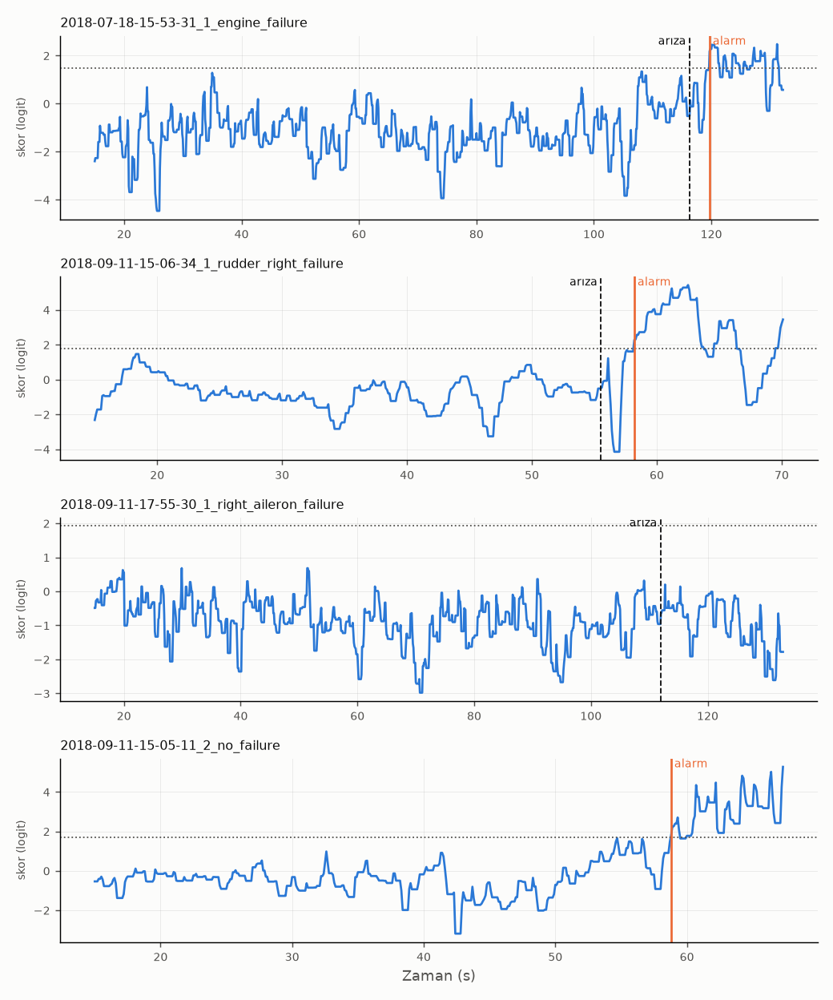

# Sonuçlar

`python karsilastir.py` ile üretildi. Etiketli 46 uçuş, 30 kayıt. Her yöntem
bir kaydı dışarıda bırakarak 30 kez eğitildi, eşik her katta yalnızca eğitim
uçuşlarından seçildi (eğitim doğruluğunu en büyük yapan eşik). Tablodaki
her uçuşun sonucu, o uçuşu hiç görmemiş bir modelden.

Metrikler ALFA makalesindeki tanımlarla, uçuş bazında: arızadan önce
verilen tek alarm o uçuşu YP yapar; tespit süreleri yalnızca DP uçuşlardan.

## Özet

| yöntem | uçuş | DP | YP | YN | DN | doğruluk | kesinlik | duyarlılık | ort_tespit_s | maks_tespit_s | YP_saat |
|---|---|---|---|---|---|---|---|---|---|---|---|
| Takip hatası eşiği | 46 | 19 | 12 | 9 | 6 | 0.54 | 0.61 | 0.53 | 8.54 | 21.17 | 13.30 |
| Lojistik regresyon | 46 | 24 | 6 | 7 | 9 | 0.72 | 0.80 | 0.67 | 2.53 | 12.93 | 6.65 |

`YP_saat`: yanlış alarm veren uçuş sayısı bölü toplam nominal uçuş süresi
(ısınmadan sonra, arızadan önce; toplam 0.90 saat).

## Arıza tipine göre

Hücreler: yakalanan / toplam (medyan tespit süresi), varsa arızadan önce
alarm veren (YP) uçuş sayısı. "(emr)" uçuşlarında arızadan ~0,07 s sonra
gemideki acil durum yörüngesi devreye giriyor; komut tarafındaki sinyaller
o andan sonra gerçek etiketi bilen bir sistemden etkileniyor. O yüzden ayrı.

| yöntem | aileron | aileron (emr) | aileron+rudder | arızasız | elevator | engines | engines (emr) | rudder |
|---|---|---|---|---|---|---|---|---|
| Takip hatası eşiği | 4/6 (11.3 s) | 0/1, 1 YP | 1/1 (10.6 s) | 4/10 YP | 1/2 (2.0 s), 1 YP | 3/7 (9.8 s), 3 YP | 7/16 (5.2 s), 3 YP | 3/3 (2.7 s) |
| Lojistik regresyon | 1/6 (12.9 s), 1 YP | 0/1 | 0/1 | 1/10 YP | 2/2 (5.7 s) | 5/7 (1.9 s), 2 YP | 13/16 (1.7 s), 2 YP | 3/3 (1.6 s) |

## Isınma süresinin etkisi (Lojistik regresyon)

Kayıtların başında otonom moda geçişin geçici rejimi var (hız 23 m/s'den
13 m/s'ye iniyor, 45° roll komutları). Bu süre boyunca alarm verilmiyor ve
bu örnekler eğitime girmiyor. Varsayılan 15 s. Aşağıdaki tablo
farklı değerlerle ne olduğunu gösteriyor; aradaki fark, 46 uçuşla ne kadar
oynama beklenmesi gerektiğini de gösteriyor.

| ısınma_s | uçuş | DP | YP | YN | DN | doğruluk | kesinlik | duyarlılık | ort_tespit_s | maks_tespit_s | YP_saat |
|---|---|---|---|---|---|---|---|---|---|---|---|
| 5.00 | 46 | 20 | 7 | 10 | 9 | 0.63 | 0.74 | 0.56 | 6.16 | 15.61 | 6.80 |
| 10.00 | 46 | 21 | 6 | 10 | 9 | 0.65 | 0.78 | 0.58 | 4.79 | 13.64 | 6.21 |
| 15.00 | 46 | 24 | 6 | 7 | 9 | 0.72 | 0.80 | 0.67 | 2.53 | 12.93 | 6.65 |
| 20.00 | 46 | 26 | 5 | 6 | 9 | 0.76 | 0.84 | 0.72 | 2.99 | 16.12 | 5.97 |

## Lojistik regresyon: uçuş uçuş

| uçuş | tip | arıza_s | alarm_s | durum | gecikme_s |
|---|---|---|---|---|---|
| carbonZ_2018-07-18-15-53-31_1_engine_failure | engines | 116.26 | 119.70 | DP | 3.44 |
| carbonZ_2018-07-18-15-53-31_2_engine_failure | engines | 73.41 | 75.50 | DP | 2.09 |
| carbonZ_2018-07-18-16-22-01_engine_failure_with_emr_traj | engines | 116.63 | 51.10 | YP | - |
| carbonZ_2018-07-18-16-37-39_1_no_failure | arızasız | - | - | DN | - |
| carbonZ_2018-07-18-16-37-39_2_engine_failure_with_emr_traj | engines | 114.06 | 114.60 | DP | 0.54 |
| carbonZ_2018-07-30-16-29-45_engine_failure_with_emr_traj | engines | 123.15 | - | YN | - |
| carbonZ_2018-07-30-16-39-00_1_engine_failure | engines | 116.79 | 118.70 | DP | 1.91 |
| carbonZ_2018-07-30-16-39-00_2_engine_failure | engines | 91.57 | 72.60 | YP | - |
| carbonZ_2018-07-30-16-39-00_3_no_failure | arızasız | - | - | DN | - |
| carbonZ_2018-07-30-17-10-45_engine_failure_with_emr_traj | engines | 117.17 | 36.40 | YP | - |
| carbonZ_2018-07-30-17-20-01_engine_failure_with_emr_traj | engines | 87.61 | 88.30 | DP | 0.69 |
| carbonZ_2018-07-30-17-36-35_engine_failure_with_emr_traj | engines | 133.43 | 135.50 | DP | 2.07 |
| carbonZ_2018-07-30-17-46-31_engine_failure_with_emr_traj | engines | 90.36 | 92.50 | DP | 2.14 |
| carbonZ_2018-09-11-11-56-30_engine_failure | engines | 103.57 | 105.50 | DP | 1.93 |
| carbonZ_2018-09-11-14-16-55_no_failure | arızasız | - | - | DN | - |
| carbonZ_2018-09-11-14-22-07_1_engine_failure | engines | 104.85 | 105.40 | DP | 0.55 |
| carbonZ_2018-09-11-14-22-07_2_engine_failure | engines | 49.86 | 15.00 | YP | - |
| carbonZ_2018-09-11-14-41-38_no_failure | arızasız | - | - | DN | - |
| carbonZ_2018-09-11-14-41-51_elevator_failure | elevator | 117.83 | 119.80 | DP | 1.97 |
| carbonZ_2018-09-11-14-52-54_left_aileron__right_aileron__failure | aileron | 105.25 | 17.20 | YP | - |
| carbonZ_2018-09-11-15-05-11_1_elevator_failure | elevator | 63.48 | 72.90 | DP | 9.42 |
| carbonZ_2018-09-11-15-05-11_2_no_failure | arızasız | - | 58.80 | YP | - |
| carbonZ_2018-09-11-15-06-34_1_rudder_right_failure | rudder | 55.52 | 58.20 | DP | 2.68 |
| carbonZ_2018-09-11-15-06-34_2_rudder_right_failure | rudder | 51.97 | 53.60 | DP | 1.63 |
| carbonZ_2018-09-11-15-06-34_3_rudder_left_failure | rudder | 60.02 | 60.70 | DP | 0.68 |
| carbonZ_2018-09-11-17-27-13_1_rudder_zero__left_aileron_failure | aileron+rudder | 116.32 | - | YN | - |
| carbonZ_2018-09-11-17-27-13_2_both_ailerons_failure | aileron | 65.77 | 78.70 | DP | 12.93 |
| carbonZ_2018-09-11-17-55-30_1_right_aileron_failure | aileron | 111.92 | - | YN | - |
| carbonZ_2018-09-11-17-55-30_2_left_aileron_failure | aileron | 49.98 | - | YN | - |
| carbonZ_2018-10-05-14-34-20_1_no_failure | arızasız | - | - | DN | - |
| carbonZ_2018-10-05-14-34-20_2_right_aileron_failure_with_emr_traj | aileron | 152.20 | - | YN | - |
| carbonZ_2018-10-05-14-37-22_1_no_failure | arızasız | - | - | DN | - |
| carbonZ_2018-10-05-14-37-22_2_right_aileron_failure | aileron | 73.38 | - | YN | - |
| carbonZ_2018-10-05-14-37-22_3_left_aileron_failure | aileron | 72.40 | - | YN | - |
| carbonZ_2018-10-05-15-52-12_1_no_failure | arızasız | - | - | DN | - |
| carbonZ_2018-10-05-15-52-12_2_no_failure | arızasız | - | - | DN | - |
| carbonZ_2018-10-05-15-52-12_3_engine_failure_with_emr_traj | engines | 49.13 | 51.40 | DP | 2.27 |
| carbonZ_2018-10-05-15-55-10_engine_failure_with_emr_traj | engines | 100.11 | 101.80 | DP | 1.69 |
| carbonZ_2018-10-05-16-04-46_engine_failure_with_emr_traj | engines | 76.19 | 77.00 | DP | 0.81 |
| carbonZ_2018-10-18-11-03-57_engine_failure_with_emr_traj | engines | 104.25 | 108.00 | DP | 3.75 |
| carbonZ_2018-10-18-11-04-00_engine_failure_with_emr_traj | engines | 111.16 | 111.70 | DP | 0.54 |
| carbonZ_2018-10-18-11-04-08_1_engine_failure_with_emr_traj | engines | 100.36 | 101.00 | DP | 0.64 |
| carbonZ_2018-10-18-11-04-08_2_engine_failure_with_emr_traj | engines | 98.22 | 101.10 | DP | 2.88 |
| carbonZ_2018-10-18-11-04-35_engine_failure_with_emr_traj | engines | 101.30 | 102.60 | DP | 1.30 |
| carbonZ_2018-10-18-11-06-06_engine_failure_with_emr_traj | engines | 102.52 | 104.80 | DP | 2.28 |
| carbonZ_2018-10-18-11-08-24_no_failure | arızasız | - | - | DN | - |

